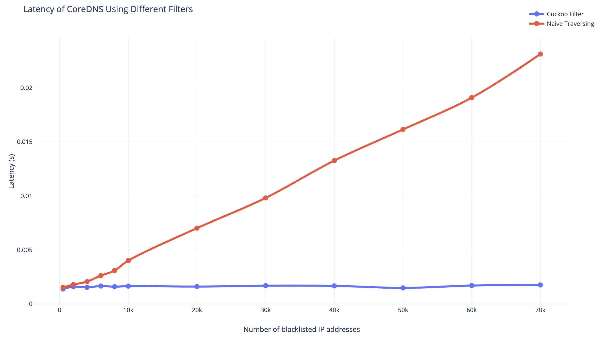

# firewall
[](https://travis-ci.com/ihac/firewall)
[](https://codecov.io/gh/ihac/firewall)

*firewall* is a CoreDNS plugin which performs as a firewall and prevents unauthorized access to protected servers.

With `firewall` enabled, users are able to define ACLs  for any DNS queries, i.e. allowing authorized queries to recurse or blocking unauthorized queries towards protected DNS zones.

This plugin can be used multiple times per Server Block.

## Syntax

```
firewall [ZONES…] {
    ACTION type QTYPE net SOURCE
    ...
}
```

- **ZONES** zones it should be authoritative for. If empty, the zones from the configuration block are used.
- **ACTION** (*allow* or *block*) defines the way of dealing with DNS queries matched by this rule. The default action is *allow*, which means a DNS query not matched by any rules will be allowed to recurse.
- **QTYPE** is the query type to match for the requests to be allowed or blocked. Common resource record types are supported. *ANY* stands for all kinds of DNS queries.
- **SOURCE** is the source ip to match for the requests to be allowed or blocked. A typical CIDR notation is supported. *ANY* stands for all possible source IP address.

## Examples

To demonstrate the use of plugin firewall, we provide some typical examples.

[Blacklist] Block all DNS queries with record type A from 192.168.0.0/16：
```
. {
    firewall {
        block type A net 192.168.0.0/16
    }
}
```

[Blacklist] Block all DNS queries from 192.168.0.0/16:

```
. {
    firewall {
        block type ANY net 192.168.0.0/16
    }
}
```

[Blacklist] Block all DNS queries with type A from any sources:

```
. {
    firewall {
        block type A net ANY
    }
}
```

[Blacklist] Block all DNS queries from 192.168.0.0/16 except 192.168.1.0/24:

```
. {
    firewall {
        allow type ANY net 192.168.1.0/24
        block type ANY net 192.168.0.0/16
    }
}
```

[Whitelist] Only allow DNS queries from 192.168.0.0/16:

```
. {
    firewall {
        allow type ANY net 192.168.0.0/16
        block type ANY net ANY
    }
}
```

[Fine-Grained] Block all DNS queries from 192.168.1.0/24 towards a.example.org:

```
example.org {
    firewall a.example.org {
        block type ANY net 192.168.1.0/24
    }
}
```

[Fine-Grained] Block all DNS queries from 192.168.1.0/24 towards a.example.org, and block all DNS queries from 192.168.2.0/24 towards b.example.org:

```
example.org {
    firewall a.example.org {
        block type ANY net 192.168.1.0/24
    }
    firewall b.example.org {
        block type ANY net 192.168.2.0/24
    }
}
```

[Preserved Identifier] Allow only DNS queries from private networks:
```
example.org {
    allow type ANY net PRIVATE
    block type ANY net ANY
}
```

[Preserved Identifier] Allow only DNS queries from local network:
```
example.org {
    allow type ANY net LOCAL
    block type ANY net ALL
}
```

[Local ACL] Block/Allow DNS queries based on ACLs from local file:
```
example.org {
    block type ANY file /path/to/blacklist.txt
}
```
## Story of GSoC

This is one of the projects under Google Summer of Code program in 2019. The goal of the project is to provide a CoreDNS plugin which supports control of access to CoreDNS by enforcing custom ACL rules on source ip address, and protect DNS servers from being attacked.

### Background & Motivation

To better understand how our plugin works and why it can help users harden the DNS server, it is important to first understand how DNS works. According to wikipedia, DNS is the phonebook of internet. It translates the domain name to IP addresses which will be used to locate specific resources. In other words, DNS resolution is kind of like the entry of the internet, and has become a critical part of the infrastructure in all companies whose business rely on the internet.

DNS is supposed to be reliable but it primarily uses UDP as the transport layer protocol. This is because UDP is much faster and more resource-friendly than TCP, which brings smooth experience to both side: DNS clients and DNS servers. Besides, DNS queries are small enough to fit quite well in UDP packets. Even though UDP performs well in undertaking the task of DNS resolution, it was born with usability, not security. Unlike TCP, UDP is connection-less and attackers could easily forge a packet with an arbitrary IP address without the efforts of guessing sequence number and intercepting current connection.

Nowadays there are many different types of DNS attacks including Denial of Service, Distributed Denial of Service, DNS amplification and so on. To lessen the chance of a DNS attack, administrators or users should pay efforts to reduce the attack surface by enforcing access control policies on incoming requests.

And this leads to the vision of our project: to empower users secure CoreDNS servers with minimal efforts. When CoreDNS serves DNS queries publicly or inside Kubernetes clusters, the source IP of the incoming DNS query is an important identity. For security considerations, only certain queries (from specific source-IP or CIDR block) should be allowed to prevent the server from being attacked. The goal of this project is to support a firewall-like source-IP based block/allow mechanism for CoreDNS.


### Design & Plan

Before the dirty coding, we'd like to formulate some critical guidelines to constrain (or help in some way) our practice of development. Also, we think it would be much better if we have specific metrics to measure the value and performance of our project quantitavely.

For the target metrics (metrics we'd want to improve):

- Rate of true positive (a request is blocked and actually it should be).
- Rate of true negative (a request is allowed and actually it should be).
- Mean time to crash/being attacked.

For the drag metrics (metrics we'd not want to hurt much):

- Lines of the config file. 
  - We should keep the project as easy-to-use as possible and don't bring much burden.
- Rate of false positive (a request is blocked while actually it should not be).
  - We certainly never want to hurt the normal use of DNS.
  - A high rate of false negative is not good of course but we could accept it.
- Latency of DNS queries.
- Throughput of CoreDNS server.
  - Requests per second (QPS).


Thanks to the efficient and flexible design, CoreDNS allows us to do anything we want based on the DNS data simply by implementing a new plugin. This project plans to introduce a plugin which performs as a firewall and prevents unauthorized access to protected servers. With our plugin (named as *firewall*) enabled, users are able to define ACLs  for any DNS queries, i.e. allowing authorized queries to recurse or blocking unauthorized queries towards protected DNS zones.

There are two key information which we'd use to restrict DNS queries: **source IP address** and **record type (QTYPE)**. 

- To protect DNS servers from being attacked, source IP identification is always needed just to have a very basic mitigation. We will enable users to restrict DNS queries based on source ip address filtering.
- Some attackers use DNS as a way for message transportation to bypass normal firewall. Restricting some uncommon QTYPE could be helpful in mitigating DNS tunneling attacks.

Finally, as a user-side product, the plugin should be intuitive enough and easy to use. We'd like to make sure it always conforms to a simple practice: *cost less, bring more*.


### Implementation

#### Plugin Syntax

```
firewall [ZONES…] {
    ACTION type QTYPE net SOURCE
    ACTION type QTYPE file LOCAL_FILE
    ...
}
```

- **ZONES** zones it should be authoritative for. If empty, the zones from the configuration block are used.
- **ACTION** (*allow* or *block*) defines the way of dealing with DNS queries matched by this rule. The default action is *allow*, which means a DNS query not matched by any rules will be allowed to recurse.
- **QTYPE** is the query type to match for the requests to be allowed or blocked. Common resource record types are supported. *ANY* stands for all kinds of DNS queries.
- **SOURCE** is the source ip to match for the requests to be allowed or blocked. A typical CIDR notation is supported. *ANY* stands for all possible source IP address.
- **LOCAL_FILE** is the local acl file which a list of IP addresses or subnets (1 ip/net per line). It should be useful when users wanna import an external blacklist.


#### Data flow

For the original design, we'd focus more on functionality and usability rather than performance. To better achieve this, we proposed a simple but workable data flow to determine whether an incoming DNS query should be blocked. 

The underlying storage for firewall rules is just an array which is quite convenient for iterating through. A rule is made up of list of zones and ACL policies, which enables us to specify the plugin multiple times in one server block. Each ACL policy defines the action to be taken when a request is matched by both QTYPE and IP address successfully.

The data flow should be quite straight forward: the plugin simply iterate through all rules; match the domain name to be resolved by the rule; parse request and check whether the source IP and QTYPE are both matched by any policy in the rule. Finally, if a request is matched by any single `block` policy, the request will be refused immediately; if a request is matched by a single `allow` policy, we still have to check other policies.

Pros:

- Easy to implement.
- Maintain the order of ACL policies.

Cons:

- Pool performance.
- Order of ACL policy might confuse users and act not as expected.


### Performance

As we mentioned earlier, there are two metrics that we do not want to hurt, or as less as possible if we have to: throughput and latency.

To measure the performance burden introduced by our plugin, we split the experiment into two groups: treatment group and control group. In treatment group we test the CoreDNS with our plugin enabled, while in control group, we don't use our plugin. Below are the results of benchmark.


### Optimization

To better understand how different filtering techniques affect the performance of CoreDNS, We refactor the original filtering logic and introduce a new interface, `Filter`, which represents all possible ways to check whether an IP address is in a large pool.

We plan to support at least 3 different **single** filters and 2 **composite** filters. Currently only 2 single filters are supported:

- [x] Naive Traversing Filter
- [x] ~~Bloom Filter~~
- [x] Cuckoo Filter
- [x] Trie Filter
- [ ] Cuckoo + Trie (progress 70%)
- [ ] Cuckoo + Trie + Fallback (progress 0%)


To measure the performance burden introduced by different filters, we test them separately by setting the proper filter type. Here are the results of benchmark:




